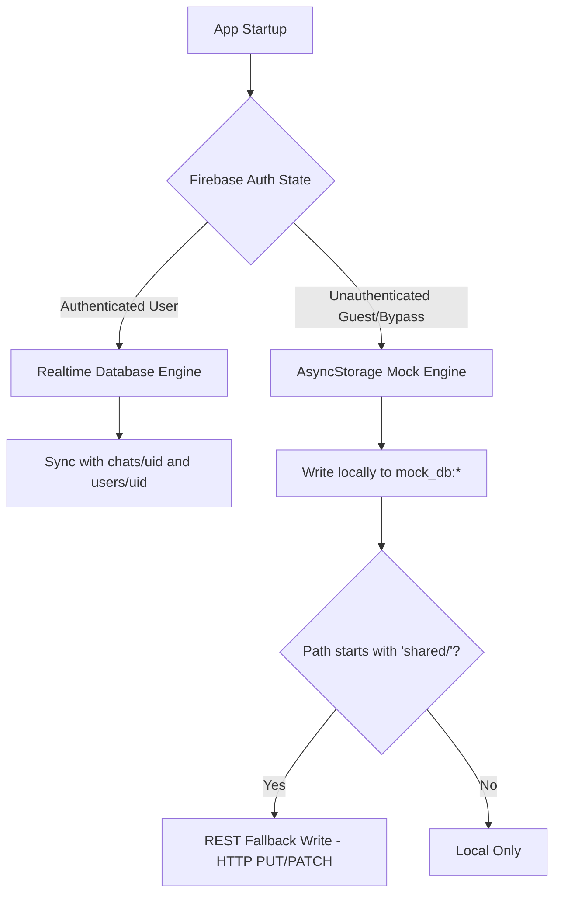
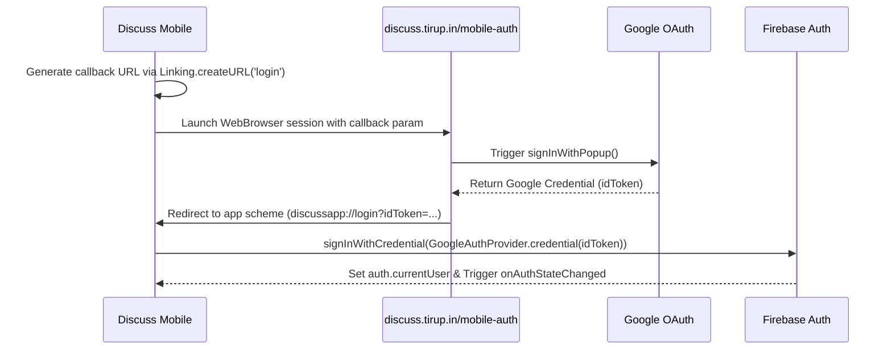

# Discuss Mobile — Engineering & Architecture Documentation 📱

Discuss Mobile is a high-performance React Native application built on **Expo SDK 56** that simulates dynamic, multi-agent discussions between AI personalities. It is designed to run natively on iOS and Android while keeping user profiles, active chats, and shared links in sync with the [Discuss Web Platform](https://discuss.tirup.in).

---

## 🛠️ Architecture & Core Mechanics

The mobile application utilizes a hybrid design to handle real-time synchronization, edge-case offline operations, and strict third-party API restrictions.



### 1. Hybrid Storage Engine (Realtime DB vs. Local Cache)
To avoid standard Firebase WebSocket connection overhead and potential crash loops in unauthenticated environments, the app encapsulates database access within a wrapped wrapper interface (`src/lib/firebase.ts`):
- **Authenticated State**: Direct binding to the Firebase Realtime Database SDK, reading and writing to `/chats/{uid}` and `/users/{uid}`.
- **Mock State**: When running in unauthenticated mode (e.g. Developer Bypass or local testing), all transactions are diverted to a file-system mock database layered over React Native's `AsyncStorage`.
- **REST Fallback Writes**: Even in unauthenticated mock mode, when a user shares a conversation, the client performs a REST API fallback write (`fetch` with `PUT`/`PATCH`) directly to the Firebase database under `/shared/{chatId}`. This allows immediate web visibility of shared chat pages without demanding a full Firebase Auth session.

### 2. Browser-Based Google OAuth Pipeline
Standard native Google Sign-In throws policy violations within standard sandboxed testing clients (like Expo Go) because the redirect URIs cannot be pre-approved on the Google Developer Console. To resolve this, Discuss uses a secure web-based authorization portal:



---

## 🎨 UI/UX & Interaction Design

The application's interface is designed for high aesthetic fidelity and responsive micro-interactions:
- **Theme-Adaptive Boot**: Custom launch screens configured via `expo-splash-screen` match the OS theme (pure white in light mode, pure black in dark mode) to prevent transition flashes.
- **Staggered Animations**: Rendered message histories slide in and fade sequentially based on their index. Newly incoming messages skip the stagger delay to render immediately with a standard 300ms glide.
- **Typing Indicator**: Features a customized pulsing text bubble that dynamically indicates which character is currently active in the generation pipeline.
- **Staggered Delays**: Simulated characters type at variable speech rates (randomized between `0.2s` and `0.8s`) to mimic natural texting cadences.

---

## ⚙️ Configuration & Environment Variables

Create a `.env` file in the root of the project. Note that environment variables must be prefixed with `EXPO_PUBLIC_` to be bundled into the Expo JavaScript client runtime.

```env
# Google Gemini API Credentials
EXPO_PUBLIC_GOOGLE_API_KEY=AIzaSy...
EXPO_PUBLIC_GOOGLE_AI_MODEL=gemini-flash-lite-latest

# Firebase Project Configuration
EXPO_PUBLIC_FIREBASE_API_KEY=AIzaSy...
EXPO_PUBLIC_FIREBASE_AUTH_DOMAIN=discuss-tirup-in.firebaseapp.com
EXPO_PUBLIC_FIREBASE_DATABASE_URL=https://discuss-tirup-in-default-rtdb.firebaseio.com
EXPO_PUBLIC_FIREBASE_PROJECT_ID=discuss-tirup-in
EXPO_PUBLIC_FIREBASE_STORAGE_BUCKET=discuss-tirup-in.firebasestorage.app
EXPO_PUBLIC_FIREBASE_MESSAGING_SENDER_ID=545906329502
EXPO_PUBLIC_FIREBASE_APP_ID=1:545906329502:android:...
```

Additionally, place your platform config certificates in the root folder:
- **Android**: `google-services.json`
- **iOS**: `GoogleService-Info.plist`

---

## 🚀 Development & Compilation

### 1. Booting Development Server
Install native node modules and start Metro Bundler:
```bash
npm install
npx expo start
```
*Press `a` to run on Android Virtual Devices, `i` to run on iOS Simulators, or scan the QR code to run on a physical device using Expo Go.*

### 2. Checking Integrity & Type-Safety
To run static analysis and verify compilation:
```bash
# Verify typecheck
npx tsc --noEmit

# Verify linter rules
npm run lint
```

### 3. Generating a Standalone Android APK (`discuss.apk`)
This project leverages **EAS Build** to compile standalone binaries in the cloud. The preview profile in `eas.json` is pre-configured to output standard shareable APKs:

```bash
# Log in to your Expo account
npx eas-cli login

# Start the cloud build
npx eas-cli build -p android --profile preview
```
Once the build concludes, copy the direct cloud link printed in your terminal to download and install the APK.
